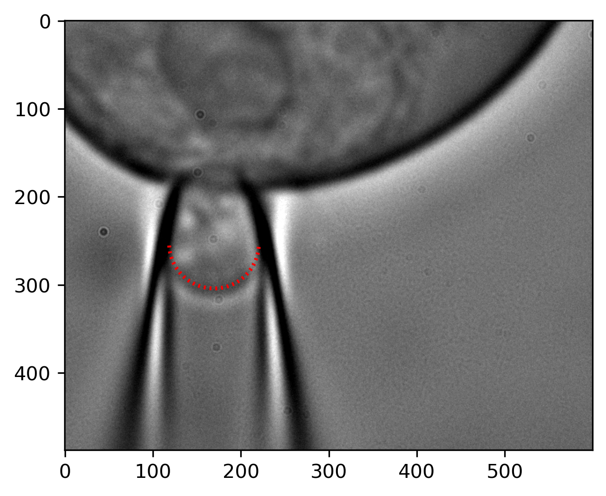

# Description

This code is used to determine membrane tension and analyze current responses  from expermnetal data generated via a combined differential interference contrast (DIC) microscopy and pressure-clamp electrophysiology approach. These data can the be used to determine the tension sensitivity of force-gated ion channels.

# Image Analysis

The notebook "mem_imaging_image_processing.ipynb" is used to determine the tension present at the membrane for a given negative pressure step stimulus. The majority of the notebook is dedicated to determining the locaiton of the membrane and then performing a circular fit to determine the theoretical radius of the membrane dome inside of the pipette. An image of an exaple circular fit is shown below:

    

 
# Electrophysiology Analysis

The notebook "mem_imaging_ephys.ipynb" is used to determine the pressure/response relationship for a pressure-step protocol. The main importance of this code for determining the tension sensitivity of a channel is to normalize peak current responses elicited during each pressure step. These nromalized values are then used, along with the membrane tension values, to determine tension sensitivity.

This code also determine the pressure of half maximal activation (P50) and slope (k) of the pressure/response relationship. The above described analysis for an example patch is shown below:

    

## Dependencies and required packages
Python 3.10.4 (other verison may work fine but it is not guaranteed)

git clone https://github.com/msindoni/piezo_tension_sensitivity.git

Virtual Envuronment (for Anaconda): conda env create -f environment.yml

# Authors
- Michael Sindoni: michael.sindoni@duke.edu
- William Sharp: william.sharp@duke.edu

# License
The copyrights of this software are owned by Duke University. As such, two licenses for this software are offered: 
1. An open-source license under the CC BY-NC-ND 4.0 (https://creativecommons.org/licenses/by-nc-nd/4.0/) license for non-commercial academic use.

2. A custom license with Duke University, for commercial use or uses without the CC BY-NC-ND 4.0 license restrictions.

As a recipient of this software, you may choose which license to receive the code under. Outside contributions to the Duke-owned code base cannot be accepted unless the contributor transfers the copyright to those changes over to Duke University.

To enter a custom license agreement without the CC BY-NC-ND 4.0 license restrictions, please contact the Digital Innovations department at the Duke Office for Translation & Commercialization (OTC) (https://otc.duke.edu/digital-innovations/#DI-team) at otcquestions@duke.edu with reference to “OTC File No. 8524” in your email.

Please note that this software is distributed AS IS, WITHOUT ANY WARRANTY; and without the implied warranty of MERCHANTABILITY or FITNESS FOR A PARTICULAR PURPOSE.

